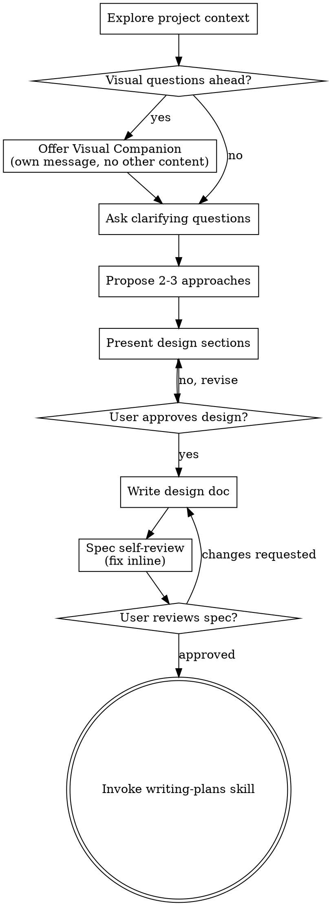

# 将创意头脑风暴成设计

通过自然的协作对话，帮助将创意转化为完整成形的设计和规格说明。

先理解当前的项目上下文，然后一次问一个问题来精炼创意。一旦你理解了要构建什么，就呈现设计并获得用户批准。

<HARD-GATE>
Do NOT invoke any implementation skill, write any code, scaffold any project, or take any implementation action until you have presented a design and the user has approved it. This applies to EVERY project regardless of perceived simplicity.
</HARD-GATE>

## 反模式："这太简单了，不需要设计"

每个项目都要走这个流程。待办清单、单函数工具、配置变更——全都适用。"简单"的项目恰恰是未经审视的假设造成最多无用功的地方。设计可以很简短（对于真正简单的项目，几句话即可），但你 MUST 呈现它并获得批准。

## 检查清单

你 MUST 为以下每一项创建一个任务，并按顺序完成：

1. **探索项目上下文** —— 检查文件、文档、最近的 commit
2. **提供 Visual Companion**（如果话题涉及视觉问题）—— 这是独立的一条消息，不与澄清问题合并。参见下文 Visual Companion 部分。
3. **提出澄清问题** —— 一次一个，理解目的、约束、成功标准
4. **提出 2-3 种方案** —— 附带权衡取舍和你的推荐
5. **呈现设计** —— 按各部分的复杂度分节呈现，每节之后获得用户批准
6. **编写设计文档** —— 保存到 `docs/superpowers/specs/YYYY-MM-DD-<topic>-design.md` 并 commit
7. **规格自审** —— 快速就地检查占位符、矛盾、歧义、范围（见下文）
8. **用户审阅已编写的规格** —— 在继续之前请用户审阅规格文件
9. **过渡到实现** —— 调用 writing-plans skill 以创建实现计划

## 流程图

**终态是调用 writing-plans。** 不要调用 frontend-design、mcp-builder 或任何其他实现类 skill。brainstorming 之后唯一要调用的 skill 就是 writing-plans。

## 流程

**理解创意：**

- 先了解当前的项目状态（文件、文档、最近的 commit）
- 在提出详细问题之前先评估范围：如果需求描述了多个独立的子系统（例如"构建一个带有聊天、文件存储、计费和分析的平台"），立即指出这一点。不要浪费问题去细化一个需要先拆解的项目。
- 如果项目过大，无法用单一规格覆盖，帮助用户拆解成子项目：有哪些独立部分，它们之间如何关联，应按什么顺序构建？然后按正常的设计流程对第一个子项目进行头脑风暴。每个子项目都有自己的规格 → 计划 → 实现循环。
- 对于范围合适的项目，一次问一个问题以精炼创意
- 尽量使用选择题，但开放式问题也可以
- 每条消息只问一个问题——如果一个话题需要更多探索，就拆成多个问题
- 聚焦于理解：目的、约束、成功标准

**探索方案：**

- 提出 2-3 种不同的方案，列出权衡取舍
- 以对话方式呈现选项，附上你的推荐和理由
- 以你推荐的方案打头，并解释原因

**呈现设计：**

- 一旦你认为自己理解了要构建的内容，就呈现设计
- 按各部分的复杂度调整篇幅：简单的几句话，细腻的最多 200-300 字
- 每一节之后询问到目前为止是否看起来正确
- 覆盖：架构、组件、数据流、错误处理、测试
- 如果有地方说不通，随时准备回头澄清

**为隔离性与清晰度而设计：**

- 将系统拆分成更小的单元，每个单元有一个明确的目的，通过良好定义的接口通信，并且可以独立地被理解和测试
- 对每个单元，你应该能回答：它做什么，如何使用它，它依赖什么？
- 不读内部实现，是否有人能理解一个单元的功能？你能在不破坏使用方的情况下修改其内部吗？如果不能，边界就还需要打磨。
- 更小、边界更清晰的单元对你来说也更易于处理——你对能一次性装进上下文的代码推理得更好，且当文件聚焦时你的修改也更可靠。当一个文件变得过大时，这通常是它承担了过多职责的信号。

**在既有代码库中工作：**

- 在提出变更之前先探索当前结构。遵循现有模式。
- 当既有代码存在影响本次工作的问题（例如文件过大、边界不清、职责缠绕）时，将针对性的改进纳入设计——就像一个好的开发者会在自己工作的代码里顺手改进一样。
- 不要提出无关的重构。专注于服务当前目标。

## 设计完成之后

**文档化：**

- 将已验证的设计（规格）写入 `docs/superpowers/specs/YYYY-MM-DD-<topic>-design.md`
  - （用户对规格存放位置的偏好优先于该默认路径）
- 如可用，使用 elements-of-style:writing-clearly-and-concisely skill
- 将设计文档 commit 到 git

**规格自审：**
写完规格文档后，以新鲜视角再看一遍：

1. **占位符扫描：** 有没有 "TBD"、"TODO"、未完成的小节或模糊的需求？修掉它们。
2. **内部一致性：** 各小节之间有矛盾吗？架构和功能描述匹配吗？
3. **范围检查：** 这份规格是否聚焦到能支撑单个实现计划，还是需要拆解？
4. **歧义检查：** 有哪条需求可能被解读成两种不同含义？如果有，挑一种并明确写清楚。

就地修复任何问题。无需再审一遍——修完就往下走。

**用户审阅关卡：**
规格自审循环通过之后，在继续之前请用户审阅已写好的规格：

> "Spec written and committed to `<path>`. Please review it and let me know if you want to make any changes before we start writing out the implementation plan."

等待用户回应。如果他们要求修改，就修改并重新运行规格审阅循环。只有在用户批准后才继续。

**实现：**

- 调用 writing-plans skill 创建详细的实现计划
- 不要调用任何其他 skill。writing-plans 是下一步。

## 核心原则

- **一次一个问题** —— 不要用多个问题压垮用户
- **优先选择题** —— 在可能的情况下，比开放式问题更易回答
- **无情地 YAGNI** —— 从所有设计中剔除不必要的功能
- **探索备选方案** —— 在定下来之前总是提出 2-3 种方案
- **增量验证** —— 呈现设计，获得批准后再推进
- **灵活应变** —— 在说不通时回头澄清

## Visual Companion

一个基于浏览器的伴侣工具，用于在头脑风暴期间展示 mockup、图示和视觉选项。它是一种工具，而不是一种模式。接受该伴侣工具意味着它可用于能从视觉呈现中受益的问题；这并不意味着每个问题都要走浏览器。

**提供该伴侣工具：** 当你预见到接下来的问题会涉及视觉内容（mockup、布局、图示）时，主动发出一次邀请以获得同意：
> "Some of what we're working on might be easier to explain if I can show it to you in a web browser. I can put together mockups, diagrams, comparisons, and other visuals as we go. This feature is still new and can be token-intensive. Want to try it? (Requires opening a local URL)"

**这条邀请 MUST 是独立的一条消息。** 不要与澄清问题、上下文摘要或其他内容合并。该消息 MUST 只包含上述邀请，别无其他内容。等用户回应之后再继续。如果他们拒绝，就以纯文本方式进行头脑风暴。

**逐个问题决策：** 即使用户已接受，也要 FOR EACH QUESTION 决定用浏览器还是终端。判断标准：**相比阅读，用户能通过观看更好地理解这个问题吗？**

- **使用浏览器** 呈现本身就是视觉性的内容——mockup、线框图、布局对比、架构图、并排视觉设计
- **使用终端** 呈现文本性的内容——需求问题、概念性选择、权衡取舍列表、A/B/C/D 文本选项、范围决策

关于 UI 话题的问题并不自动就是视觉问题。"在这个语境下 personality 意味着什么？"是概念性问题——用终端。"哪个向导布局更好？"是视觉问题——用浏览器。

如果他们同意使用该伴侣工具，继续之前先阅读详细指南：
`skills/brainstorming/visual-companion.md`
