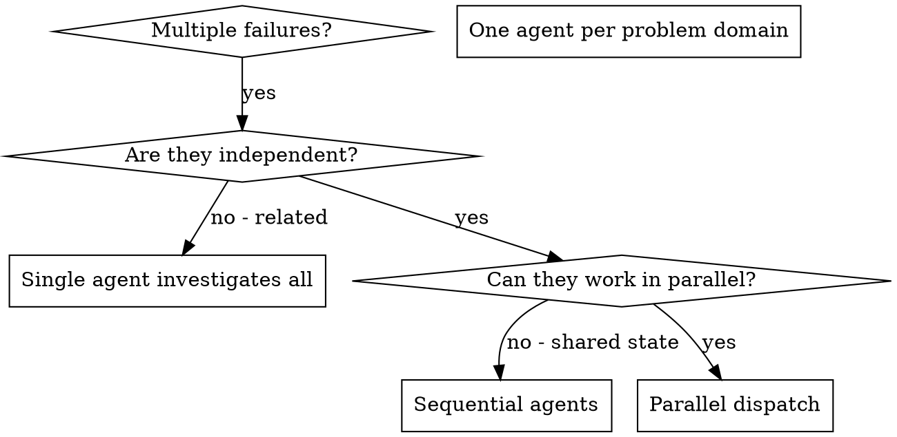

# Dispatching Parallel Agents

## Overview

你把任务委派给具有隔离上下文的专门 agent。通过精心设计它们的指令和上下文，你能确保它们专注于任务并成功完成。它们绝不应继承你当前 session 的上下文或历史——你要为它们构建恰好所需的信息。这样也能为协调工作保留你自己的上下文。

当你面对多个彼此无关的失败时（不同的测试文件、不同的子系统、不同的 bug），顺序排查会白白浪费时间。每个排查都是独立的，可以并行进行。

**核心原则：** 每个独立的问题域派发一个 agent，让它们并行推进。

## When to Use



**适用时机：**
- 3 个及以上测试文件因不同根因而失败
- 多个子系统各自独立地出问题
- 每个问题都能在脱离其他问题上下文的情况下被理解
- 各排查之间没有共享状态

**不适用时机：**
- 失败彼此相关（修好一个可能连带修好其他）
- 需要了解系统整体状态
- Agent 之间会相互干扰

## The Pattern

### 1. Identify Independent Domains

按照「什么坏了」对失败进行分组：
- 文件 A 的测试：工具批准流程
- 文件 B 的测试：批次完成行为
- 文件 C 的测试：Abort 功能

各个域彼此独立——修复工具批准不会影响 abort 测试。

### 2. Create Focused Agent Tasks

每个 agent 都应拿到：
- **明确范围：** 单个测试文件或子系统
- **清晰目标：** 让这些测试通过
- **约束条件：** 不要改动其他代码
- **预期输出：** 你发现了什么、修复了什么的总结

### 3. Dispatch in Parallel

```typescript
// In Claude Code / AI environment
Task("Fix agent-tool-abort.test.ts failures")
Task("Fix batch-completion-behavior.test.ts failures")
Task("Fix tool-approval-race-conditions.test.ts failures")
// All three run concurrently
```

### 4. Review and Integrate

当 agent 回报时：
- 阅读每份总结
- 核实各修复之间不冲突
- 运行完整测试套件
- 整合所有改动

## Agent Prompt Structure

好的 agent prompt 应该：
1. **聚焦** - 单一明确的问题域
2. **自包含** - 包含理解问题所需的全部上下文
3. **对输出明确** - agent 应返回什么？

```markdown
Fix the 3 failing tests in src/agents/agent-tool-abort.test.ts:

1. "should abort tool with partial output capture" - expects 'interrupted at' in message
2. "should handle mixed completed and aborted tools" - fast tool aborted instead of completed
3. "should properly track pendingToolCount" - expects 3 results but gets 0

These are timing/race condition issues. Your task:

1. Read the test file and understand what each test verifies
2. Identify root cause - timing issues or actual bugs?
3. Fix by:
   - Replacing arbitrary timeouts with event-based waiting
   - Fixing bugs in abort implementation if found
   - Adjusting test expectations if testing changed behavior

Do NOT just increase timeouts - find the real issue.

Return: Summary of what you found and what you fixed.
```

## Common Mistakes

**❌ 太宽泛：** "Fix all the tests" - agent 会迷失方向
**✅ 具体：** "Fix agent-tool-abort.test.ts" - 范围聚焦

**❌ 无上下文：** "Fix the race condition" - agent 不知道在哪儿
**✅ 有上下文：** 贴上错误信息和测试名

**❌ 无约束：** agent 可能会把一切都重构
**✅ 有约束：** "Do NOT change production code" 或 "Fix tests only"

**❌ 输出模糊：** "Fix it" - 你不知道到底改了什么
**✅ 具体：** "Return summary of root cause and changes"

## When NOT to Use

**失败彼此相关：** 修一个可能连带修好其他——先一并排查
**需要整体上下文：** 必须看到整个系统才能理解
**探索性调试：** 你还不知道哪里坏了
**共享状态：** agent 之间会相互干扰（编辑同一文件、使用同一资源）

## Real Example from Session

**场景：** 大规模重构后 3 个文件共 6 个测试失败

**失败：**
- agent-tool-abort.test.ts：3 个失败（时序问题）
- batch-completion-behavior.test.ts：2 个失败（工具未执行）
- tool-approval-race-conditions.test.ts：1 个失败（执行次数为 0）

**决策：** 各域独立——abort 逻辑、批次完成、竞态条件彼此无关

**派发：**
```
Agent 1 → Fix agent-tool-abort.test.ts
Agent 2 → Fix batch-completion-behavior.test.ts
Agent 3 → Fix tool-approval-race-conditions.test.ts
```

**结果：**
- Agent 1：用事件驱动等待替换 timeout
- Agent 2：修复了事件结构 bug（threadId 放错了位置）
- Agent 3：加入了对异步工具执行完成的等待

**整合：** 各修复彼此独立、无冲突，整套测试通过

**节省时间：** 3 个问题并行解决而非顺序解决

## Key Benefits

1. **并行化** - 多个排查同时进行
2. **聚焦** - 每个 agent 范围狭窄，需要跟踪的上下文更少
3. **独立性** - agent 之间互不干扰
4. **速度** - 用解决 1 个问题的时间解决 3 个

## Verification

Agent 返回之后：
1. **审阅每份总结** - 弄清改了什么
2. **检查冲突** - agent 是否改了同一块代码？
3. **运行完整测试套件** - 确认各修复协同生效
4. **抽查** - agent 可能犯系统性错误

## Real-World Impact

来自一次调试 session（2025-10-03）：
- 3 个文件共 6 个失败
- 并行派发 3 个 agent
- 所有排查并行完成
- 所有修复成功整合
- agent 改动之间零冲突
