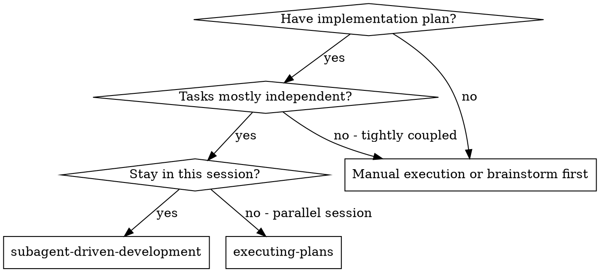
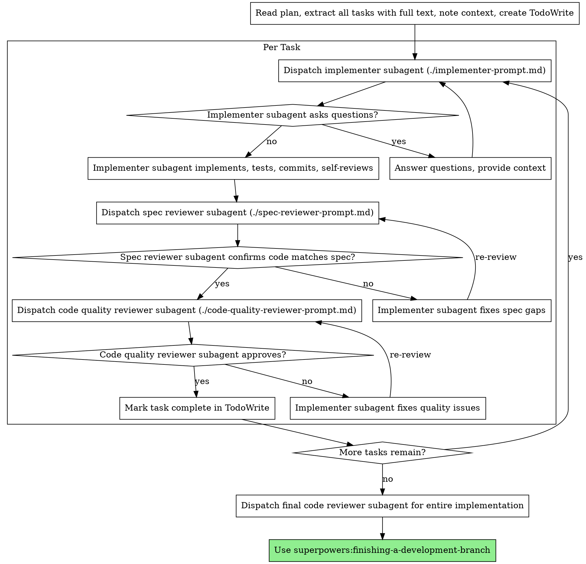

# Subagent-Driven Development

通过为每个任务派发全新的 subagent 来执行计划，每个任务完成后进行两阶段审查：先做 spec 合规审查，再做代码质量审查。

**为什么用 subagent：** 你把任务委派给具有隔离上下文的专门 agent。通过精心设计它们的指令和上下文，你能确保它们专注于任务并成功完成。它们绝不应继承你当前 session 的上下文或历史——你要为它们构建恰好所需的信息。这样也能为协调工作保留你自己的上下文。

**核心原则：** 每个任务派发全新 subagent + 两阶段审查（先 spec 后质量）= 高质量、快速迭代

## When to Use



**对比 Executing Plans（并行 session）：**
- 同一 session（无上下文切换）
- 每个任务派发全新 subagent（无上下文污染）
- 每个任务后进行两阶段审查：先 spec 合规，再代码质量
- 迭代更快（任务之间无需人工介入）

## The Process



## Model Selection

为每个角色选择能胜任的最弱模型，以节约成本、提升速度。

**机械性实现任务**（孤立函数、spec 清晰、1-2 个文件）：使用快而便宜的模型。当计划描述得足够明确时，大多数实现任务都是机械性的。

**集成与判断任务**（跨多文件协调、模式匹配、调试）：使用标准模型。

**架构、设计、审查任务**：使用可用的最强模型。

**任务复杂度信号：**
- 涉及 1-2 个文件且 spec 完整 → 便宜模型
- 涉及多个文件且有集成问题 → 标准模型
- 需要设计判断或对代码库的广泛理解 → 最强模型

## Handling Implementer Status

Implementer subagent 会回报四种状态之一，分别处理：

**DONE：** 进入 spec 合规审查。

**DONE_WITH_CONCERNS：** Implementer 完成了工作但提出了疑虑。进入审查前先读完这些疑虑。若涉及正确性或范围，先处理再审查；若只是观察（例如「这个文件变大了」），记下并进入审查。

**NEEDS_CONTEXT：** Implementer 需要未被提供的信息。补齐缺失的上下文后重新派发。

**BLOCKED：** Implementer 无法完成任务。评估阻塞点：
1. 若是上下文问题，补充上下文后以同一模型重新派发
2. 若任务需要更强推理，换更强的模型重新派发
3. 若任务过大，拆成更小的部分
4. 若计划本身有问题，升级给人类

**绝不**忽视升级信号，也不要在不做任何改变的情况下让同一模型重试。Implementer 说它卡住了，就说明有东西需要调整。

## Prompt Templates

- `./implementer-prompt.md` - 派发 implementer subagent
- `./spec-reviewer-prompt.md` - 派发 spec 合规审查 subagent
- `./code-quality-reviewer-prompt.md` - 派发代码质量审查 subagent

## Example Workflow

```
You: I'm using Subagent-Driven Development to execute this plan.

[Read plan file once: docs/superpowers/plans/feature-plan.md]
[Extract all 5 tasks with full text and context]
[Create TodoWrite with all tasks]

Task 1: Hook installation script

[Get Task 1 text and context (already extracted)]
[Dispatch implementation subagent with full task text + context]

Implementer: "Before I begin - should the hook be installed at user or system level?"

You: "User level (~/.config/superpowers/hooks/)"

Implementer: "Got it. Implementing now..."
[Later] Implementer:
  - Implemented install-hook command
  - Added tests, 5/5 passing
  - Self-review: Found I missed --force flag, added it
  - Committed

[Dispatch spec compliance reviewer]
Spec reviewer: ✅ Spec compliant - all requirements met, nothing extra

[Get git SHAs, dispatch code quality reviewer]
Code reviewer: Strengths: Good test coverage, clean. Issues: None. Approved.

[Mark Task 1 complete]

Task 2: Recovery modes

[Get Task 2 text and context (already extracted)]
[Dispatch implementation subagent with full task text + context]

Implementer: [No questions, proceeds]
Implementer:
  - Added verify/repair modes
  - 8/8 tests passing
  - Self-review: All good
  - Committed

[Dispatch spec compliance reviewer]
Spec reviewer: ❌ Issues:
  - Missing: Progress reporting (spec says "report every 100 items")
  - Extra: Added --json flag (not requested)

[Implementer fixes issues]
Implementer: Removed --json flag, added progress reporting

[Spec reviewer reviews again]
Spec reviewer: ✅ Spec compliant now

[Dispatch code quality reviewer]
Code reviewer: Strengths: Solid. Issues (Important): Magic number (100)

[Implementer fixes]
Implementer: Extracted PROGRESS_INTERVAL constant

[Code reviewer reviews again]
Code reviewer: ✅ Approved

[Mark Task 2 complete]

...

[After all tasks]
[Dispatch final code-reviewer]
Final reviewer: All requirements met, ready to merge

Done!
```

## Advantages

**对比人工执行：**
- Subagent 自然地遵循 TDD
- 每个任务上下文全新（不混淆）
- 并行安全（subagent 之间不互相干扰）
- Subagent 可以提问（开工前及进行中皆可）

**对比 Executing Plans：**
- 同一 session（无需交接）
- 连续推进（无等待）
- 审查检查点自动执行

**效率收益：**
- 无文件读取开销（controller 直接提供全文）
- Controller 精确整理所需上下文
- Subagent 一次性拿到完整信息
- 问题在开工前浮现（而非事后）

**质量闸门：**
- 自审在交付前发现问题
- 两阶段审查：先 spec 合规，再代码质量
- 审查循环确保修复真正生效
- Spec 合规防止超建/欠建
- 代码质量确保实现扎实

**成本：**
- Subagent 调用次数更多（每个任务一个 implementer + 两个 reviewer）
- Controller 需要做更多前期工作（一次性抽取所有任务）
- 审查循环会增加迭代次数
- 但能及早发现问题（比后续调试更便宜）

## Red Flags

**绝不：**
- 在未获得用户明确同意前，于 main/master 分支上开始实现
- 跳过审查（spec 合规或代码质量）
- 在存在未修复的问题时继续推进
- 并行派发多个 implementation subagent（会冲突）
- 让 subagent 读取计划文件（应直接提供全文）
- 省略场景交代（subagent 需理解任务所处位置）
- 忽视 subagent 的提问（先回答再让它继续）
- 对 spec 合规「差不多就行」（spec reviewer 发现问题 = 未完成）
- 跳过审查循环（reviewer 发现问题 = implementer 修复 = 再次审查）
- 用 implementer 的自审替代正式审查（两者都需要）
- **在 spec 合规尚未通过 ✅ 时就开始代码质量审查**（顺序错误）
- 在任一审查仍有未结问题时就推进到下一个任务

**当 subagent 提问时：**
- 回答清晰完整
- 必要时补充上下文
- 不要催促它匆忙进入实现

**当 reviewer 发现问题时：**
- 由同一 implementer subagent 修复
- Reviewer 再次审查
- 重复直到通过
- 不要跳过再次审查

**当 subagent 任务失败时：**
- 派发修复 subagent 并给出具体指示
- 不要手动修复（会污染上下文）

## Integration

**必需的工作流 skill：**
- **superpowers:using-git-worktrees** - 必需：开工前先搭建隔离工作区
- **superpowers:writing-plans** - 产出本 skill 将执行的计划
- **superpowers:requesting-code-review** - 供 reviewer subagent 使用的代码审查模板
- **superpowers:finishing-a-development-branch** - 所有任务完成后收尾开发

**Subagent 应使用：**
- **superpowers:test-driven-development** - Subagent 为每个任务遵循 TDD

**备选工作流：**
- **superpowers:executing-plans** - 用于并行 session 而非同一 session 执行
