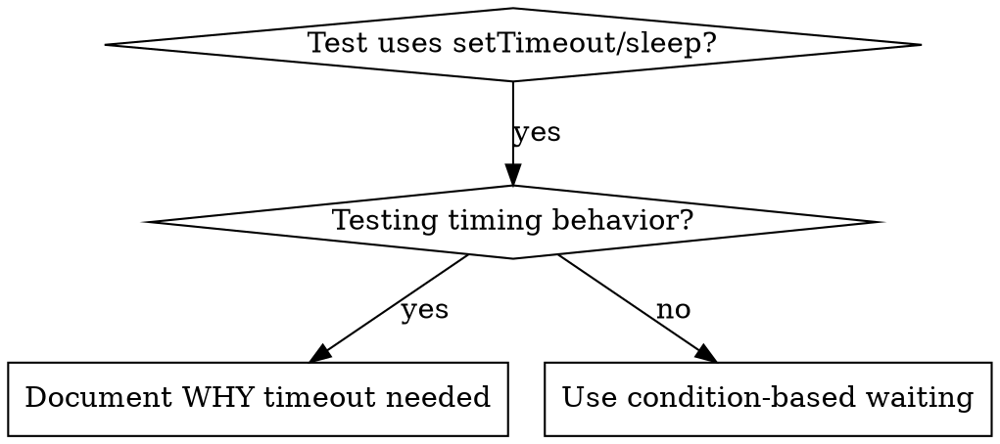

# 基于条件的等待（condition-based waiting）

## 概述

易碎测试（flaky test）经常靠任意的延时来猜时序。这会制造 race condition（竞态条件）：测试在快速机器上通过，在负载下或 CI 里却失败。

**核心原则**：等待你真正关心的那个条件，而不是猜它大概要多久。

## 何时使用



**适用场景**：

- 测试里有任意的延时（`setTimeout`、`sleep`、`time.sleep()`）
- 测试是 flaky（有时通过，有负载时失败）
- 并行跑测试时会超时
- 需要等待异步操作完成

**不适用的场景**：

- 测试的正是时序行为本身（debounce、throttle 的间隔）
- 如果使用任意超时，总是记录 WHY

## 核心 pattern

```typescript
// ❌ BEFORE: Guessing at timing
await new Promise(r => setTimeout(r, 50));
const result = getResult();
expect(result).toBeDefined();

// ✅ AFTER: Waiting for condition
await waitFor(() => getResult() !== undefined);
const result = getResult();
expect(result).toBeDefined();
```

## 常见 pattern 速查

| 场景 | Pattern |
|------|---------|
| 等事件 | `waitFor(() => events.find(e => e.type === 'DONE'))` |
| 等状态 | `waitFor(() => machine.state === 'ready')` |
| 等数量 | `waitFor(() => items.length >= 5)` |
| 等文件 | `waitFor(() => fs.existsSync(path))` |
| 复合条件 | `waitFor(() => obj.ready && obj.value > 10)` |

## 实现

通用的轮询函数：
```typescript
async function waitFor<T>(
  condition: () => T | undefined | null | false,
  description: string,
  timeoutMs = 5000
): Promise<T> {
  const startTime = Date.now();

  while (true) {
    const result = condition();
    if (result) return result;

    if (Date.now() - startTime > timeoutMs) {
      throw new Error(`Timeout waiting for ${description} after ${timeoutMs}ms`);
    }

    await new Promise(r => setTimeout(r, 10)); // Poll every 10ms
  }
}
```

本目录下的 `condition-based-waiting-example.ts` 提供了完整实现，以及来自真实调试会话的领域辅助函数（`waitForEvent`、`waitForEventCount`、`waitForEventMatch`）。

## 常见错误

**❌ 轮询太快**：`setTimeout(check, 1)`——浪费 CPU
**✅ 修正**：每 10ms 轮询一次

**❌ 没有超时**：条件永远不满足就会死循环
**✅ 修正**：始终设置超时，并给出清晰的错误信息

**❌ 数据过时**：在循环外缓存了状态
**✅ 修正**：在循环内部调用 getter，拿到最新数据

## 何时使用任意超时是合理的

```typescript
// Tool ticks every 100ms - need 2 ticks to verify partial output
await waitForEvent(manager, 'TOOL_STARTED'); // First: wait for condition
await new Promise(r => setTimeout(r, 200));   // Then: wait for timed behavior
// 200ms = 2 ticks at 100ms intervals - documented and justified
```

**要求**：

1. 先等触发条件
2. 基于已知的时序（而不是靠猜）
3. 加注释说明 WHY

## 真实影响

来自真实调试会话（2025-10-03）：

- 修好了 3 个文件中 15 个 flaky 测试
- 通过率：60% → 100%
- 执行时间缩短 40%
- 不再有 race condition
