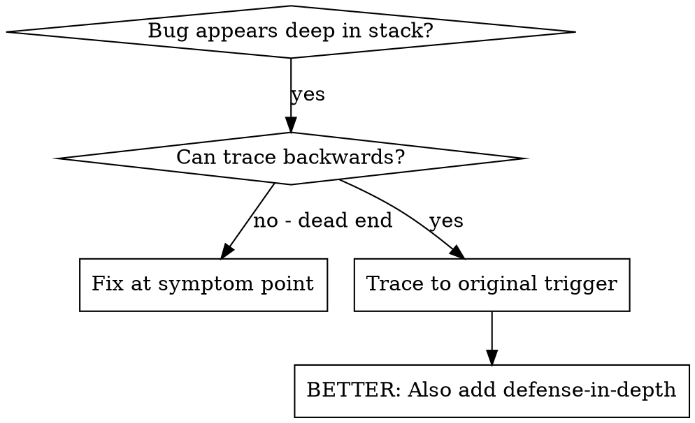
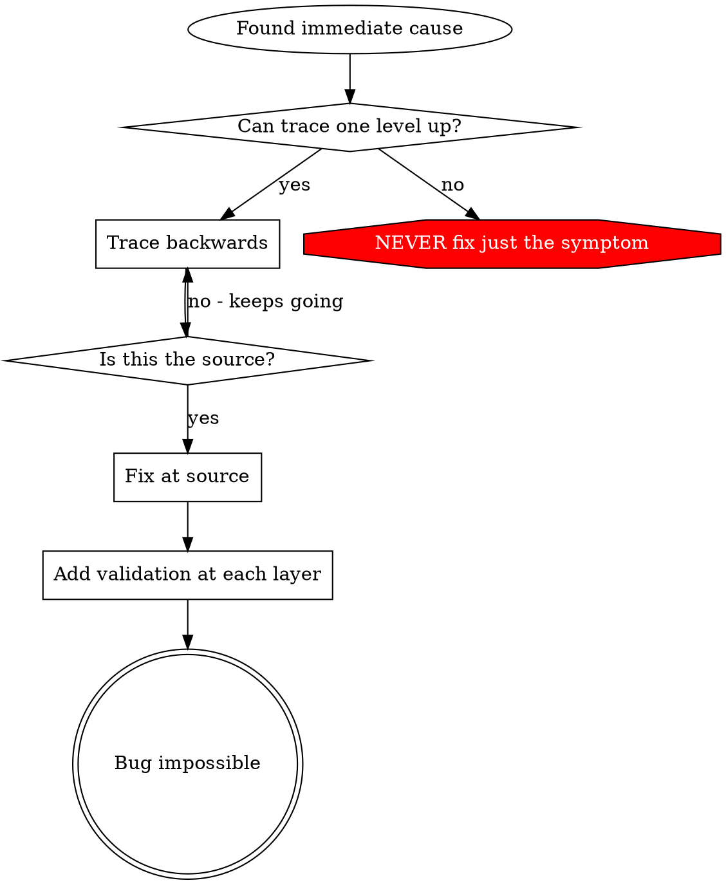

# Root Cause 反向追踪

## 概述

bug 常常表现在调用栈深处（git init 跑到了错误目录、文件创建到错误位置、数据库用错误路径打开）。你的直觉是在错误出现的地方修它，但那只是在处理症状。

**核心原则**：沿调用链反向追踪，直到找到最初的触发点，然后在源头修复。

## 何时使用



**适用场景**：

- 错误发生在执行链深处（不在入口点）
- stack trace 显示很长的调用链
- 不清楚非法数据从哪里来
- 需要找到是哪个测试/代码触发了问题

## 追踪过程

### 1. 观察症状
```
Error: git init failed in /Users/jesse/project/packages/core
```

### 2. 找到直接原因

**哪段代码直接导致了它？**
```typescript
await execFileAsync('git', ['init'], { cwd: projectDir });
```

### 3. 追问：是谁调用了这里？
```typescript
WorktreeManager.createSessionWorktree(projectDir, sessionId)
  → called by Session.initializeWorkspace()
  → called by Session.create()
  → called by test at Project.create()
```

### 4. 继续往上追

**传入了什么值？**

- `projectDir = ''`（空字符串！）
- 空字符串作为 `cwd` 会被解析为 `process.cwd()`
- 也就是源码目录！

### 5. 找到最初的触发点

**空字符串是从哪里来的？**
```typescript
const context = setupCoreTest(); // Returns { tempDir: '' }
Project.create('name', context.tempDir); // Accessed before beforeEach!
```

## 加入 stack trace

当没法手动追踪时，加入埋点：

```typescript
// Before the problematic operation
async function gitInit(directory: string) {
  const stack = new Error().stack;
  console.error('DEBUG git init:', {
    directory,
    cwd: process.cwd(),
    nodeEnv: process.env.NODE_ENV,
    stack,
  });

  await execFileAsync('git', ['init'], { cwd: directory });
}
```

**关键**：在测试里使用 `console.error()`（不用 logger，logger 可能不显示）

**跑起来并抓取**：
```bash
npm test 2>&1 | grep 'DEBUG git init'
```

**分析 stack trace**：

- 找测试文件名
- 找到触发该调用的行号
- 识别 pattern（是同一个测试吗？同一个参数吗？）

## 定位是哪个测试在污染环境

如果某现象出现在测试里、但你不知道是哪个测试造成的：

使用本目录下的二分脚本 `find-polluter.sh`：

```bash
./find-polluter.sh '.git' 'src/**/*.test.ts'
```

逐个跑测试，停在第一个污染者那里。用法见脚本。

## 真实示例：空 projectDir

**症状**：`.git` 在 `packages/core/`（源码目录）下被创建

**追踪链**：

1. `git init` 在 `process.cwd()` 执行 ← cwd 参数为空
2. WorktreeManager 被传入空 projectDir
3. Session.create() 传入空字符串
4. 测试在 beforeEach 之前访问了 `context.tempDir`
5. setupCoreTest() 初始返回 `{ tempDir: '' }`

**Root cause**：顶层变量的初始化访问了尚未赋值的空值

**修复**：把 tempDir 改成 getter，在 beforeEach 之前访问就抛错

**同时加入纵深防御**：

- Layer 1：Project.create() 校验目录
- Layer 2：WorkspaceManager 校验非空
- Layer 3：NODE_ENV 守卫拒绝在 tmpdir 之外执行 git init
- Layer 4：在 git init 前记录 stack trace

## 关键原则



**NEVER 只在错误出现的地方修复。** 反向追踪到最初的触发点。

## Stack Trace 小贴士

**测试里**：用 `console.error()`，不用 logger——logger 可能被抑制
**操作之前**：在危险操作之前打日志，不要等失败之后
**带上下文**：目录、cwd、环境变量、时间戳
**捕获 stack**：`new Error().stack` 会显示完整调用链

## 真实影响

来自真实调试会话（2025-10-03）：

- 通过 5 层追踪找到 root cause
- 在源头修复（getter 校验）
- 加入 4 层纵深防御
- 1847 个测试通过，零污染
