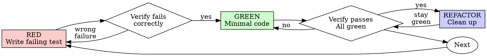

# 测试驱动开发（TDD）

## 概述

先写测试。看它失败。写最少的代码让它通过。

**核心原则：** 如果你没有亲眼看着测试失败，你就不知道它是不是在测对的东西。

**违反规则的字面意思，就是违反规则的精神。**

## 何时使用

**始终使用：**
- 新功能
- bug 修复
- 重构
- 行为变更

**例外（问你的人类伙伴）：**
- 一次性的原型
- 生成的代码
- 配置文件

想着"就这一次跳过 TDD"？停下。这是合理化的借口。

## 铁律

```
NO PRODUCTION CODE WITHOUT A FAILING TEST FIRST
```

在写测试前写了代码？删掉。重来。

**没有例外：**
- 不要把它留作"参考"
- 不要一边写测试一边"改编"它
- 不要看它
- 删除就是删除

从测试出发重新实现。就这样。

## 红-绿-重构



### RED - 写失败的测试

写一个最简的测试，展示应该发生什么。

<Good>
```typescript
test('retries failed operations 3 times', async () => {
  let attempts = 0;
  const operation = () => {
    attempts++;
    if (attempts < 3) throw new Error('fail');
    return 'success';
  };

  const result = await retryOperation(operation);

  expect(result).toBe('success');
  expect(attempts).toBe(3);
});
```
名字清晰，测试真实行为，只测一件事
</Good>

<Bad>
```typescript
test('retry works', async () => {
  const mock = jest.fn()
    .mockRejectedValueOnce(new Error())
    .mockRejectedValueOnce(new Error())
    .mockResolvedValueOnce('success');
  await retryOperation(mock);
  expect(mock).toHaveBeenCalledTimes(3);
});
```
名字含糊，测的是 mock 而不是代码
</Bad>

**要求：**
- 一个行为
- 清晰的名字
- 真实代码（除非不可避免，否则不用 mock）

### 验证 RED - 看它失败

**强制执行。永远不要跳过。**

```bash
npm test path/to/test.test.ts
```

确认：
- 测试失败（不是出错）
- 失败信息符合预期
- 失败是因为功能缺失（不是因为拼写错误）

**测试通过？** 你测的是已经存在的行为。修测试。

**测试报错？** 修错误，重跑直到它以正确的方式失败。

### GREEN - 最少的代码

写出让测试通过的最简代码。

<Good>
```typescript
async function retryOperation<T>(fn: () => Promise<T>): Promise<T> {
  for (let i = 0; i < 3; i++) {
    try {
      return await fn();
    } catch (e) {
      if (i === 2) throw e;
    }
  }
  throw new Error('unreachable');
}
```
刚好够通过
</Good>

<Bad>
```typescript
async function retryOperation<T>(
  fn: () => Promise<T>,
  options?: {
    maxRetries?: number;
    backoff?: 'linear' | 'exponential';
    onRetry?: (attempt: number) => void;
  }
): Promise<T> {
  // YAGNI
}
```
过度设计
</Bad>

不要加功能、不要重构其他代码、也不要"改进"超出测试要求的范围。

### 验证 GREEN - 看它通过

**强制执行。**

```bash
npm test path/to/test.test.ts
```

确认：
- 测试通过
- 其他测试仍然通过
- 输出干净（没有错误、警告）

**测试失败？** 修代码，别修测试。

**其他测试失败？** 现在就修。

### REFACTOR - 清理

仅在绿灯之后：
- 去除重复
- 改进命名
- 抽取辅助函数

保持测试通过。不要加行为。

### 重复

为下一个功能写下一个失败的测试。

## 好的测试

| 质量 | 好 | 坏 |
|---------|------|-----|
| **最简** | 只测一件事。名字里有 "and"？拆开。 | `test('validates email and domain and whitespace')` |
| **清晰** | 名字描述行为 | `test('test1')` |
| **体现意图** | 展示期望的 API | 掩盖代码应该做什么 |

## 为什么顺序重要

**"我会在之后写测试验证它能工作"**

在代码之后写的测试会立即通过。立即通过什么也证明不了：
- 可能测错了东西
- 可能测的是实现，不是行为
- 可能漏掉了你忘掉的边界情况
- 你从未见过它抓到 bug

先写测试迫使你看到测试失败，证明它确实在测某样东西。

**"我已经手动测过所有边界情况了"**

手动测试是随意的。你以为自己都测了，但是：
- 没有记录测了什么
- 代码变更后无法重跑
- 压力之下容易忘掉某些情形
- "我试的时候能工作" ≠ 全面

自动化测试是系统化的。每次都以相同的方式运行。

**"删掉 X 个小时的工作是浪费"**

沉没成本谬误。时间已经花掉了。你现在的选择：
- 删掉用 TDD 重写（再花 X 小时，高信心）
- 留着然后在之后加测试（30 分钟，低信心，很可能有 bug）

"浪费"指的是留着你无法信任的代码。没有真正测试的可工作代码就是技术债。

**"TDD 教条主义，务实意味着要变通"**

TDD 本身就是务实的：
- 在提交前发现 bug（比事后调试快）
- 防止回归（测试立即抓到破坏）
- 记录行为（测试展示如何使用代码）
- 让重构成为可能（自由修改，测试抓住破坏）

"务实"的捷径 = 在生产中调试 = 更慢。

**"事后写测试能达到相同目标——在精神不在仪式"**

不对。事后写的测试回答的是"这段代码做什么？"先写的测试回答的是"这段代码应该做什么？"

事后写的测试会被你的实现带偏。你测的是你已经造好的东西，不是需求。你验证的是你记得的边界情况，不是发现的边界情况。

先写测试迫使你在实现之前发现边界情况。事后写的测试验证的是你是否记得一切（你记不得）。

事后写 30 分钟的测试 ≠ TDD。你拿到覆盖率，失去了测试确实在起作用的证据。

## 常见的合理化借口

| 借口 | 现实 |
|--------|---------|
| "太简单了不用测" | 简单的代码也会坏。测试只需 30 秒。 |
| "我之后会测" | 立即通过的测试什么也证明不了。 |
| "事后测能达到相同目标" | 事后测 = "这段代码做什么？" 先写测试 = "这段代码应该做什么？" |
| "已经手动测过了" | 随意 ≠ 系统化。没有记录，无法重跑。 |
| "删掉 X 小时是浪费" | 沉没成本谬误。留着未经验证的代码就是技术债。 |
| "留作参考，先写测试" | 你会去改编它。那就是事后测试。删除就是删除。 |
| "需要先探索" | 可以。扔掉探索代码，从 TDD 开始。 |
| "难测 = 设计不清晰" | 听测试的话。难测 = 难用。 |
| "TDD 会拖慢我" | TDD 比调试快。务实 = 先写测试。 |
| "手测更快" | 手测无法证明边界情况。每次改动你都得重测。 |
| "现有代码没有测试" | 你在改进它。为现有代码加测试。 |

## 危险信号 - 停下，重来

- 测试之前就有代码
- 实现之后才写测试
- 测试立即通过
- 说不清测试为什么失败
- "之后再加"测试
- 合理化"就这一次"
- "我已经手测过了"
- "事后测能达到相同目的"
- "重在精神不在仪式"
- "留作参考"或"改编现有代码"
- "已经花了 X 小时，删了是浪费"
- "TDD 是教条主义，我是在务实"
- "这次不一样，因为……"

**所有这些都意味着：删掉代码。用 TDD 重新开始。**

## 例子：bug 修复

**bug：** 空邮箱被接受

**RED**
```typescript
test('rejects empty email', async () => {
  const result = await submitForm({ email: '' });
  expect(result.error).toBe('Email required');
});
```

**验证 RED**
```bash
$ npm test
FAIL: expected 'Email required', got undefined
```

**GREEN**
```typescript
function submitForm(data: FormData) {
  if (!data.email?.trim()) {
    return { error: 'Email required' };
  }
  // ...
}
```

**验证 GREEN**
```bash
$ npm test
PASS
```

**REFACTOR**
如有需要，抽取出可复用于多个字段的验证逻辑。

## 验证清单

在声明工作完成之前：

- [ ] 每个新函数/方法都有测试
- [ ] 实现前看到每个测试失败
- [ ] 每个测试都因预期原因失败（功能缺失，不是拼写错误）
- [ ] 为让每个测试通过只写了最少的代码
- [ ] 所有测试通过
- [ ] 输出干净（没有错误、警告）
- [ ] 测试使用真实代码（除非不可避免才用 mock）
- [ ] 边界情况和错误都覆盖了

勾不满所有项？你跳过了 TDD。重来。

## 卡住的时候

| 问题 | 解决办法 |
|---------|----------|
| 不知道怎么测 | 写出你希望的 API。先写断言。问你的人类伙伴。 |
| 测试过于复杂 | 设计过于复杂。简化接口。 |
| 必须 mock 一切 | 代码耦合太紧。用依赖注入。 |
| 测试 setup 很大 | 抽取辅助函数。还是复杂？简化设计。 |

## 与调试结合

发现 bug？写一个能重现它的失败测试。走 TDD 循环。测试证明修复有效并防止回归。

不要在没有测试的情况下修 bug。

## 测试反模式

添加 mock 或测试工具时，阅读 @testing-anti-patterns.md 以避免常见陷阱：
- 测的是 mock 的行为，而不是真实行为
- 在生产类上添加仅用于测试的方法
- 在不理解依赖的情况下 mock

## 最终法则

```
Production code → test exists and failed first
Otherwise → not TDD
```

没有你的人类伙伴的许可，不得有例外。
