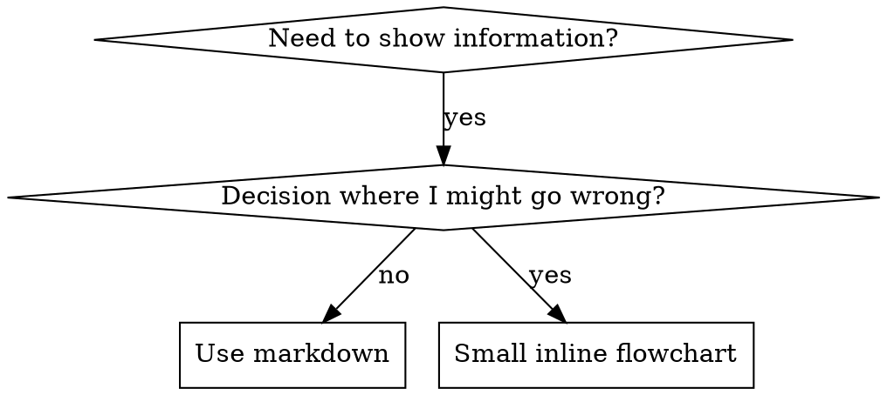

# Writing Skills

## Overview

**Writing skills IS Test-Driven Development applied to process documentation.**

**个人 skill 存放于 agent 专属目录中（Claude Code 使用 `~/.claude/skills`，Codex 使用 `~/.agents/skills/`）**

你编写测试用例（用 subagent 构造压力场景），观察它们失败（基线行为），编写 skill（文档），观察测试通过（agent 遵守），然后重构（堵上漏洞）。

**核心原则**：如果你没有观察过 agent 在没有 skill 的情况下失败，你就不知道这个 skill 是否教会了正确的东西。

**REQUIRED BACKGROUND：** 使用本 skill 之前，你 MUST 先理解 superpowers:test-driven-development。那个 skill 定义了基础的 RED-GREEN-REFACTOR 循环。本 skill 将 TDD 适配到文档场景。

**官方指南**：Anthropic 官方的 skill 编写最佳实践见 anthropic-best-practices.md。该文档提供了额外的模式与指南，与本 skill 以 TDD 为核心的方法互为补充。

## What is a Skill?

**skill** 是对已验证技术、模式或工具的参考指南。skill 帮助未来的 Claude 实例找到并应用有效的方法。

**skill 是**：可复用的技术、模式、工具、参考指南

**skill 不是**：关于你某次如何解决问题的叙事

## TDD Mapping for Skills

| TDD 概念 | Skill 创建 |
|-------------|----------------|
| **测试用例** | 使用 subagent 的压力场景 |
| **生产代码** | skill 文档（SKILL.md） |
| **测试失败（RED）** | 没有 skill 时 agent 违反规则（基线） |
| **测试通过（GREEN）** | 有 skill 时 agent 遵守 |
| **Refactor** | 在保持遵守的前提下堵上漏洞 |
| **先写测试** | 编写 skill 之前先跑基线场景 |
| **观察失败** | 记录 agent 使用的确切合理化说辞 |
| **最小代码** | 针对这些具体违规行为编写 skill |
| **观察通过** | 验证 agent 现在是否遵守 |
| **重构循环** | 发现新合理化说辞 → 堵上 → 重新验证 |

整个 skill 创建过程遵循 RED-GREEN-REFACTOR。

## When to Create a Skill

**何时创建：**
- 这个技术对你而言不是凭直觉就能想到的
- 在多个项目中你还会再次参考它
- 模式适用面广（不是特定于某个项目）
- 其他人也会从中受益

**不要为以下情况创建：**
- 一次性的解决方案
- 已有详尽文档的标准实践
- 项目特定的约定（放进 CLAUDE.md）
- 机械性约束（如果可以用正则或校验来强制，就去自动化它——文档留给需要判断力的场景）

## Skill Types

### Technique
具体方法，有可遵循的步骤（condition-based-waiting、root-cause-tracing）

### Pattern
思考问题的方式（flatten-with-flags、test-invariants）

### Reference
API 文档、语法指南、工具文档（office docs）

## Directory Structure


```
skills/
  skill-name/
    SKILL.md              # Main reference (required)
    supporting-file.*     # Only if needed
```

**扁平命名空间** —— 所有 skill 都在同一个可搜索的命名空间内

**以下内容应放入单独文件：**
1. **大量参考资料**（100+ 行）—— API 文档、完整语法
2. **可复用工具** —— 脚本、工具、模板

**以下内容内联在 SKILL.md：**
- 原则与概念
- 代码模式（< 50 行）
- 其他一切

## SKILL.md Structure

**Frontmatter（YAML）：**
- 两个必填字段：`name` 和 `description`（全部支持的字段见 [agentskills.io/specification](https://agentskills.io/specification)）
- 总长度最多 1024 字符
- `name`：只能使用字母、数字、连字符（不能有括号或特殊字符）
- `description`：第三人称，只描述何时使用（不描述做了什么）
  - 以 "Use when..." 开头，聚焦于触发条件
  - 包含具体的症状、情境和上下文
  - **绝不概述 skill 的流程或工作流**（原因见下文 CSO 小节）
  - 尽量控制在 500 字符以内

```markdown
---
name: Skill-Name-With-Hyphens
description: Use when [specific triggering conditions and symptoms]
---

# Skill Name

## Overview
What is this? Core principle in 1-2 sentences.

## When to Use
[Small inline flowchart IF decision non-obvious]

Bullet list with SYMPTOMS and use cases
When NOT to use

## Core Pattern (for techniques/patterns)
Before/after code comparison

## Quick Reference
Table or bullets for scanning common operations

## Implementation
Inline code for simple patterns
Link to file for heavy reference or reusable tools

## Common Mistakes
What goes wrong + fixes

## Real-World Impact (optional)
Concrete results
```


## Claude Search Optimization (CSO)

**发现性至关重要**：未来的 Claude 需要能够找到你的 skill

### 1. Rich Description Field

**目的**：Claude 会读取 description 来决定为当前任务加载哪些 skill。让它能回答：「我现在应该读这个 skill 吗？」

**格式**：以 "Use when..." 开头，聚焦于触发条件

**CRITICAL：description = 何时使用，而不是 skill 做了什么**

description 应当只描述触发条件。不要在 description 中概述 skill 的流程或工作流。

**为什么这很重要**：测试发现，当 description 概述了 skill 的工作流时，Claude 可能直接按 description 执行，而不去读完整的 skill 内容。一条写着 "code review between tasks" 的 description 导致 Claude 只做了一次 review，尽管 skill 的流程图清楚地展示了两次 review（先是 spec compliance 然后是 code quality）。

当 description 被改成仅有 "Use when executing implementation plans with independent tasks"（没有工作流概述），Claude 就会正确地阅读流程图并遵循两阶段的 review 流程。

**陷阱**：概述工作流的 description 会制造一条 Claude 会抄的捷径。于是 skill 正文变成了 Claude 会跳过的文档。

```yaml
# ❌ BAD: Summarizes workflow - Claude may follow this instead of reading skill
description: Use when executing plans - dispatches subagent per task with code review between tasks

# ❌ BAD: Too much process detail
description: Use for TDD - write test first, watch it fail, write minimal code, refactor

# ✅ GOOD: Just triggering conditions, no workflow summary
description: Use when executing implementation plans with independent tasks in the current session

# ✅ GOOD: Triggering conditions only
description: Use when implementing any feature or bugfix, before writing implementation code
```

**内容：**
- 使用具体的触发条件、症状和情境，表明此 skill 适用
- 描述*问题*（race conditions、inconsistent behavior），而非*特定语言的症状*（setTimeout、sleep）
- 除非 skill 本身与技术相关，否则触发条件应与技术无关
- 如果 skill 与特定技术相关，在触发条件中明确说明
- 使用第三人称（会被注入到 system prompt）
- **绝不概述 skill 的流程或工作流**

```yaml
# ❌ BAD: Too abstract, vague, doesn't include when to use
description: For async testing

# ❌ BAD: First person
description: I can help you with async tests when they're flaky

# ❌ BAD: Mentions technology but skill isn't specific to it
description: Use when tests use setTimeout/sleep and are flaky

# ✅ GOOD: Starts with "Use when", describes problem, no workflow
description: Use when tests have race conditions, timing dependencies, or pass/fail inconsistently

# ✅ GOOD: Technology-specific skill with explicit trigger
description: Use when using React Router and handling authentication redirects
```

### 2. Keyword Coverage

使用 Claude 会搜索的词汇：
- 错误信息："Hook timed out"、"ENOTEMPTY"、"race condition"
- 症状："flaky"、"hanging"、"zombie"、"pollution"
- 同义词："timeout/hang/freeze"、"cleanup/teardown/afterEach"
- 工具：实际命令、库名、文件类型

### 3. Descriptive Naming

**使用主动语态，动词优先：**
- ✅ `creating-skills` 而非 `skill-creation`
- ✅ `condition-based-waiting` 而非 `async-test-helpers`

### 4. Token Efficiency (Critical)

**问题**：getting-started 和常被引用的 skill 会在每次对话中都被加载。每个 token 都很重要。

**目标字数：**
- getting-started 工作流：每个 <150 词
- 常加载的 skill：全文 <200 词
- 其他 skill：<500 词（也要保持简洁）

**技巧：**

**把细节移到工具的 help 里：**
```bash
# ❌ BAD: Document all flags in SKILL.md
search-conversations supports --text, --both, --after DATE, --before DATE, --limit N

# ✅ GOOD: Reference --help
search-conversations supports multiple modes and filters. Run --help for details.
```

**使用交叉引用：**
```markdown
# ❌ BAD: Repeat workflow details
When searching, dispatch subagent with template...
[20 lines of repeated instructions]

# ✅ GOOD: Reference other skill
Always use subagents (50-100x context savings). REQUIRED: Use [other-skill-name] for workflow.
```

**压缩示例：**
```markdown
# ❌ BAD: Verbose example (42 words)
your human partner: "How did we handle authentication errors in React Router before?"
You: I'll search past conversations for React Router authentication patterns.
[Dispatch subagent with search query: "React Router authentication error handling 401"]

# ✅ GOOD: Minimal example (20 words)
Partner: "How did we handle auth errors in React Router?"
You: Searching...
[Dispatch subagent → synthesis]
```

**消除冗余：**
- 不要重复交叉引用的 skill 里的内容
- 不要解释命令本身就显而易见的内容
- 不要给同一个模式写多个示例

**验证：**
```bash
wc -w skills/path/SKILL.md
# getting-started workflows: aim for <150 each
# Other frequently-loaded: aim for <200 total
```

**以你所做的事或核心洞察命名：**
- ✅ `condition-based-waiting` > `async-test-helpers`
- ✅ `using-skills` 而非 `skill-usage`
- ✅ `flatten-with-flags` > `data-structure-refactoring`
- ✅ `root-cause-tracing` > `debugging-techniques`

**动名词（-ing）适合表示流程：**
- `creating-skills`、`testing-skills`、`debugging-with-logs`
- 主动、描述你正在做的动作

### 4. Cross-Referencing Other Skills

**在文档中引用其他 skill 时：**

仅使用 skill 名称，并加上明确的要求标记：
- ✅ Good：`**REQUIRED SUB-SKILL:** Use superpowers:test-driven-development`
- ✅ Good：`**REQUIRED BACKGROUND:** You MUST understand superpowers:systematic-debugging`
- ❌ Bad：`See skills/testing/test-driven-development`（不清楚是否必需）
- ❌ Bad：`@skills/testing/test-driven-development/SKILL.md`（强制加载，消耗上下文）

**为什么不用 @ 链接**：`@` 语法会立刻强制加载文件，在你还没用到之前就消耗 200k+ 上下文。

## Flowchart Usage



**只在以下情况使用流程图：**
- 不显而易见的决策点
- 你可能会过早停止的流程循环
- 「何时用 A 还是 B」的决策

**绝不在以下情况使用流程图：**
- 参考材料 → 使用表格、列表
- 代码示例 → 使用 markdown 代码块
- 线性指令 → 使用编号列表
- 无语义含义的标签（step1、helper2）

graphviz 样式规则见 @graphviz-conventions.dot。

**给你的人类伙伴可视化展示**：使用本目录下的 `render-graphs.js` 将一个 skill 的流程图渲染为 SVG：
```bash
./render-graphs.js ../some-skill           # Each diagram separately
./render-graphs.js ../some-skill --combine # All diagrams in one SVG
```

## Code Examples

**一个优秀的示例胜过许多平庸的示例**

选择最相关的语言：
- 测试技术 → TypeScript/JavaScript
- 系统调试 → Shell/Python
- 数据处理 → Python

**好的示例：**
- 完整可运行
- 注释清晰、说明为什么这么做
- 来自真实场景
- 清楚展示模式
- 可直接改写使用（而非通用模板）

**不要：**
- 用 5 种以上语言实现
- 创建填空式模板
- 写人为造作的示例

你很擅长移植代码——一个好示例就够了。

## File Organization

### Self-Contained Skill
```
defense-in-depth/
  SKILL.md    # Everything inline
```
何时使用：所有内容都能放下，不需要大量参考

### Skill with Reusable Tool
```
condition-based-waiting/
  SKILL.md    # Overview + patterns
  example.ts  # Working helpers to adapt
```
何时使用：工具是可复用的代码，而不是单纯的叙述

### Skill with Heavy Reference
```
pptx/
  SKILL.md       # Overview + workflows
  pptxgenjs.md   # 600 lines API reference
  ooxml.md       # 500 lines XML structure
  scripts/       # Executable tools
```
何时使用：参考材料过大，不适合内联

## The Iron Law (Same as TDD)

```
NO SKILL WITHOUT A FAILING TEST FIRST
```

这同时适用于**新** skill 和对**现有** skill 的**修改**。

还没测试就先写 skill？删掉。重新开始。
不测试就修改 skill？同样违反。

**无例外：**
- 不适用于「简单补充」
- 不适用于「只是加一节」
- 不适用于「文档更新」
- 不要把未测试的改动留着作为「参考」
- 不要在跑测试的同时「改造」它
- 删除就是删除

**REQUIRED BACKGROUND：** superpowers:test-driven-development skill 解释了为什么这一点重要。同样的原则适用于文档。

## Testing All Skill Types

不同类型的 skill 需要不同的测试方法：

### Discipline-Enforcing Skills (rules/requirements)

**例子**：TDD、verification-before-completion、designing-before-coding

**测试方式：**
- 学术性问题：他们理解规则吗？
- 压力场景：他们在压力下会遵守吗？
- 多重压力组合：时间 + 沉没成本 + 疲惫
- 识别合理化说辞并加入明确的反制

**成功标准**：agent 在最大压力下仍然遵守规则

### Technique Skills (how-to guides)

**例子**：condition-based-waiting、root-cause-tracing、defensive-programming

**测试方式：**
- 应用场景：他们能正确应用这项技术吗？
- 变体场景：他们能处理边界情况吗？
- 缺失信息测试：说明是否有缺口？

**成功标准**：agent 能在新场景中成功应用该技术

### Pattern Skills (mental models)

**例子**：reducing-complexity、information-hiding concepts

**测试方式：**
- 识别场景：他们能识别何时应用这个模式吗？
- 应用场景：他们能使用这个心智模型吗？
- 反例：他们知道何时**不应该**应用吗？

**成功标准**：agent 能正确识别何时、如何应用该模式

### Reference Skills (documentation/APIs)

**例子**：API 文档、命令参考、库指南

**测试方式：**
- 检索场景：他们能找到正确的信息吗？
- 应用场景：他们能正确使用找到的内容吗？
- 缺口测试：常见用例是否都覆盖了？

**成功标准**：agent 能找到并正确应用参考信息

## Common Rationalizations for Skipping Testing

| 借口 | 事实 |
|--------|---------|
| "Skill is obviously clear" | 你觉得清楚 ≠ 其他 agent 觉得清楚。测试它。 |
| "It's just a reference" | 参考资料也会有缺口、含糊之处。测试检索。 |
| "Testing is overkill" | 未测试的 skill 一定有问题。15 分钟测试省下几小时。 |
| "I'll test if problems emerge" | 问题 = agent 没法用这个 skill。部署前就得测。 |
| "Too tedious to test" | 测试没比在生产中调试坏 skill 更烦。 |
| "I'm confident it's good" | 过度自信必出问题。无论如何都要测。 |
| "Academic review is enough" | 读 ≠ 用。测试应用场景。 |
| "No time to test" | 部署未测试的 skill，后面修起来更费时间。 |

**以上所有说辞的含义都是：部署前必须测试。无例外。**

## Bulletproofing Skills Against Rationalization

强制执行纪律的 skill（如 TDD）需要抵御合理化。agent 很聪明，在压力下会找漏洞。

**心理学提示**：理解说服技术**为什么**有效，有助于你系统地应用它们。关于权威、承诺、稀缺、社会认同、共同体原则的研究基础（Cialdini, 2021; Meincke et al., 2025），见 persuasion-principles.md。

### Close Every Loophole Explicitly

不仅要陈述规则——还要明令禁止具体的绕行方式：

<Bad>
```markdown
Write code before test? Delete it.
```
</Bad>

<Good>
```markdown
Write code before test? Delete it. Start over.

**No exceptions:**
- Don't keep it as "reference"
- Don't "adapt" it while writing tests
- Don't look at it
- Delete means delete
```
</Good>

### Address "Spirit vs Letter" Arguments

尽早加入一条基础原则：

```markdown
**Violating the letter of the rules is violating the spirit of the rules.**
```

这一句就能切断整类「我在遵守精神」的合理化。

### Build Rationalization Table

从基线测试（见下文 Testing 小节）中收集合理化说辞。agent 提出的每一条借口都进入表格：

```markdown
| Excuse | Reality |
|--------|---------|
| "Too simple to test" | Simple code breaks. Test takes 30 seconds. |
| "I'll test after" | Tests passing immediately prove nothing. |
| "Tests after achieve same goals" | Tests-after = "what does this do?" Tests-first = "what should this do?" |
```

### Create Red Flags List

让 agent 在合理化时易于自检：

```markdown
## Red Flags - STOP and Start Over

- Code before test
- "I already manually tested it"
- "Tests after achieve the same purpose"
- "It's about spirit not ritual"
- "This is different because..."

**All of these mean: Delete code. Start over with TDD.**
```

### Update CSO for Violation Symptoms

在 description 中加入「你即将违反规则」时的症状：

```yaml
description: use when implementing any feature or bugfix, before writing implementation code
```

## RED-GREEN-REFACTOR for Skills

遵循 TDD 循环：

### RED: Write Failing Test (Baseline)

在**没有** skill 的情况下用 subagent 运行压力场景。记录确切行为：
- 他们做了哪些选择？
- 他们用了什么合理化说辞（逐字）？
- 哪些压力触发了违规？

这就是「观察测试失败」——在写 skill 之前，你 MUST 先看到 agent 天然会怎么做。

### GREEN: Write Minimal Skill

编写针对这些具体合理化说辞的 skill。不要为假设的情况添加多余内容。

在**有** skill 的情况下运行相同的场景。agent 现在应当遵守。

### REFACTOR: Close Loopholes

agent 又找到新合理化说辞？加入明确的反制。重新测试直到无懈可击。

**测试方法论**：完整的测试方法论见 @testing-skills-with-subagents.md：
- 如何编写压力场景
- 压力类型（时间、沉没成本、权威、疲惫）
- 系统地堵上漏洞
- 元测试技巧

## Anti-Patterns

### ❌ Narrative Example
"In session 2025-10-03, we found empty projectDir caused..."
**为什么糟糕**：过于具体，不可复用

### ❌ Multi-Language Dilution
example-js.js、example-py.py、example-go.go
**为什么糟糕**：质量都平庸，维护负担大

### ❌ Code in Flowcharts
```dot
step1 [label="import fs"];
step2 [label="read file"];
```
**为什么糟糕**：无法复制粘贴，难以阅读

### ❌ Generic Labels
helper1、helper2、step3、pattern4
**为什么糟糕**：标签应当具有语义含义

## STOP: Before Moving to Next Skill

**在写完任意一个 skill 之后，你 MUST 停下并完成部署流程。**

**不要：**
- 批量创建多个 skill 而不逐个测试
- 在当前 skill 尚未验证之前就转向下一个
- 以「批量更高效」为由跳过测试

**下面的部署清单对**每一个** skill 都是强制性的。**

部署未测试的 skill = 部署未测试的代码。这是对质量标准的违反。

## Skill Creation Checklist (TDD Adapted)

**IMPORTANT：用 TodoWrite 为下面的每一项清单项创建 todo。**

**RED 阶段——编写失败的测试：**
- [ ] Create pressure scenarios (3+ combined pressures for discipline skills)
- [ ] Run scenarios WITHOUT skill - document baseline behavior verbatim
- [ ] Identify patterns in rationalizations/failures

**GREEN 阶段——编写最小 skill：**
- [ ] Name uses only letters, numbers, hyphens (no parentheses/special chars)
- [ ] YAML frontmatter with required `name` and `description` fields (max 1024 chars; see [spec](https://agentskills.io/specification))
- [ ] Description starts with "Use when..." and includes specific triggers/symptoms
- [ ] Description written in third person
- [ ] Keywords throughout for search (errors, symptoms, tools)
- [ ] Clear overview with core principle
- [ ] Address specific baseline failures identified in RED
- [ ] Code inline OR link to separate file
- [ ] One excellent example (not multi-language)
- [ ] Run scenarios WITH skill - verify agents now comply

**REFACTOR 阶段——堵上漏洞：**
- [ ] Identify NEW rationalizations from testing
- [ ] Add explicit counters (if discipline skill)
- [ ] Build rationalization table from all test iterations
- [ ] Create red flags list
- [ ] Re-test until bulletproof

**质量检查：**
- [ ] Small flowchart only if decision non-obvious
- [ ] Quick reference table
- [ ] Common mistakes section
- [ ] No narrative storytelling
- [ ] Supporting files only for tools or heavy reference

**部署：**
- [ ] Commit skill to git and push to your fork (if configured)
- [ ] Consider contributing back via PR (if broadly useful)

## Discovery Workflow

未来的 Claude 如何找到你的 skill：

1. **遇到问题**（"tests are flaky"）
3. **找到 SKILL**（description 匹配）
4. **浏览 overview**（这是否相关？）
5. **阅读模式**（快速参考表）
6. **加载示例**（仅在实现时）

**为这个流程优化**——把可搜索的词尽早、频繁放出来。

## The Bottom Line

**创建 skill 就是为流程文档做 TDD。**

同样的铁律：先写失败的测试才有 skill。
同样的循环：RED（基线）→ GREEN（写 skill）→ REFACTOR（堵漏洞）。
同样的好处：更好的质量、更少的意外、无懈可击的结果。

如果你对代码遵循 TDD，就对 skill 也遵循它。这是同一种纪律在文档上的应用。
